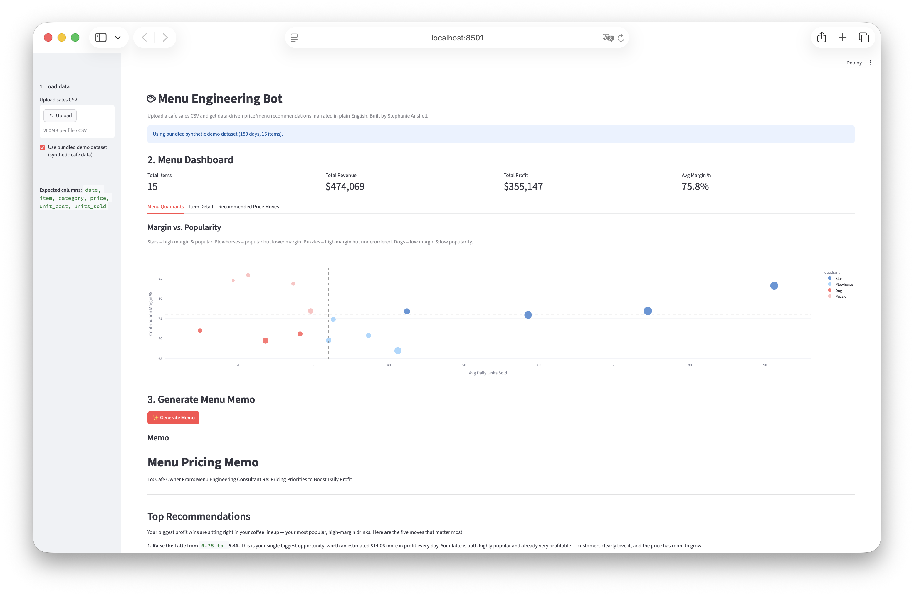
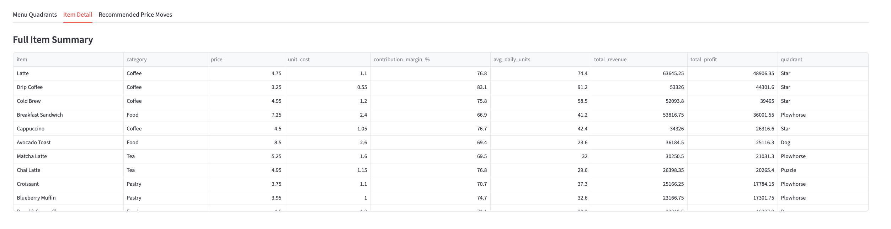
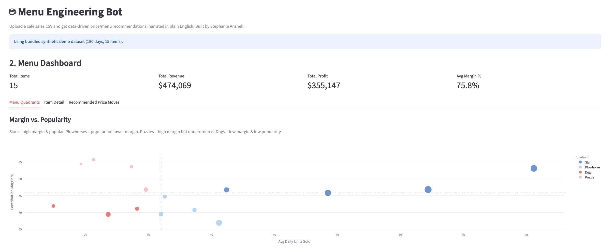
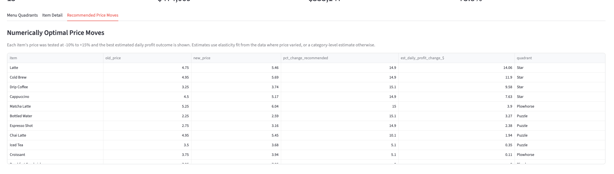
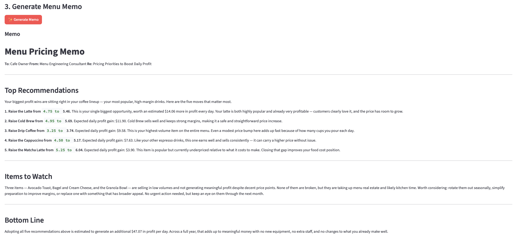

# ☕ Menu Engineering Bot

A tool that reads a cafe's sales data and tells the owner — in plain English — which
menu items to reprice, promote, or cut, backed by real price-elasticity math instead
of guesswork.

**Why this project:** I worked as a barista and in food service before pivoting into
data science. Every cafe I've worked in made pricing and menu decisions by gut feel.
This project applies the same kind of analysis I used in my data science internships
(price/demand modeling, automated reporting) to a problem I've seen up close from the
other side of the counter.

## Demo Preview

### Dashboard Overview



The dashboard summarizes total menu items, revenue, profit, average margin, and menu quadrant positioning using the bundled demo cafe dataset.

### Menu Item Summary



The item detail table shows each menu item’s category, price, unit cost, contribution margin, average daily units sold, total revenue, total profit, and quadrant classification.

### Menu Engineering Quadrants



Items are classified into Stars, Plowhorses, Puzzles, and Dogs based on popularity and contribution margin.

### Recommended Price Moves



The app tests possible price changes and recommends the estimated profit-maximizing move for each item.

### AI-Generated Menu Memo



Claude converts the numeric analysis into a plain-English pricing memo for cafe owners.

## What it does

1. **Ingests sales data** — `date, item, category, price, unit_cost, units_sold`
2. **Runs menu engineering analysis** (`src/analysis.py`, pure Python/pandas, no LLM):
   - Contribution margin and sales velocity per item
   - Price elasticity estimated from historical price variation or a category-level
     prior when an item's price never changed
   - Classic menu-engineering quadrant classification: **Star / Plowhorse / Puzzle / Dog**
   - Simulated profit impact of candidate price changes (-10% to +15%), picks the
     best move per item
3. **Generates a plain-English memo** (`src/agent.py`) — Claude takes the *numbers only*
   and writes a short, prioritized memo a non-technical cafe
   owner could act on immediately.
4. **Interactive dashboard** (`src/app.py`, Streamlit) — upload your own CSV or use the
   bundled synthetic dataset, see the quadrant chart, full item table, recommended
   price moves, and generate the memo on demand.

## Why the math and the LLM are kept separate

This is intentional, and mirrors how I'd actually want this used in a real business:
the elasticity model and profit simulation are deterministic and auditable — you can
check every number by hand. The LLM's only job is to **explain and prioritize** those
numbers in plain language. It never generates or alters a figure. This avoids the
classic failure mode of LLM tools "hallucinating" business numbers.

## Demo data

The bundled `data/cafe_sales.csv` is **synthetic** — 180 days × 15 menu items,
generated with realistic prices, costs, day-of-week seasonality, and a known
elasticity baked in per item. See `src/generate_data.py` for the assumptions. It's
meant to demonstrate the pipeline end-to-end; swap in a real POS export with the same
column structure and it works the same way.

## Running it

```bash
git clone https://github.com/stephaniepatriciaans/menu-engineering-bot
cd menu-engineering-bot
pip install -r requirements.txt

# Generate the demo dataset, optional because it is already included
python src/generate_data.py

# Set your Anthropic API key to enable memo generation
export ANTHROPIC_API_KEY="your_key_here"

# Run the dashboard
streamlit run src/app.py
```

You can also enable the AI-generated memo by creating a `.env` file in the project root:

```env
ANTHROPIC_API_KEY=your_key_here
```

Without an API key, the dashboard and all numeric analysis still work — only the
LLM-generated memo requires a key.

## Project structure

```text
menu-engineering-bot/
├── assets/
│   ├── dashboard.png
│   ├── item_summary.png
│   ├── quadrant_chart.png
│   ├── price_moves.png
│   └── ai_memo.png
├── data/
│   ├── cafe_sales.csv        # synthetic demo dataset generated
│   └── menu_reference.csv    # ground-truth menu/elasticity used to generate demo data
├── src/
│   ├── generate_data.py      # synthetic data generator
│   ├── analysis.py           # margin, velocity, elasticity, quadrant, price simulation
│   ├── validation.py         # CSV validation and data-quality checks
│   ├── agent.py              # Claude API call -> plain-English memo
│   └── app.py                # Streamlit dashboard
├── .env.example
├── .gitignore
├── requirements.txt
└── README.md
```

## Tech stack

Python, pandas, NumPy, Streamlit, Plotly, Anthropic API, Claude

## Example Business Impact

Using the bundled synthetic cafe dataset, the app produces item-level recommendations such as:

- Raise the price of a high-demand drink by 10% when the model estimates demand will remain strong.
- Raise the Latte price from $4.75 to $5.46, with an estimated daily profit gain of $14.06.
- Raise the Cold Brew price from $4.95 to $5.69, with an estimated daily profit gain of $11.90.
- Raise the Drip Coffee price from $3.25 to $3.74, with an estimated daily profit gain of $9.58.
- Flag low-margin popular items as “Plowhorses,” meaning they may need repricing, smaller portions, or supplier cost review.
- Identify low-margin, low-volume “Dog” items that may need redesign, bundling, or removal.
- Flag lower-performing items such as Avocado Toast, Bagel and Cream Cheese, and Granola Bowl as items to watch for redesign, bundling, or seasonal rotation.
- Estimate the expected daily profit change for each recommended price move so the owner can prioritize the highest-impact actions first.

Example output format:

> Recommended action: Increase Iced Latte price by 10%.  
> Estimated impact: +$18.40 daily profit.  
> Reason: The item is popular, and the estimated demand drop is smaller than the added margin from the price increase.

Across the top five recommendations, the app estimates an additional $47.07 in daily profit. This turns menu pricing from guesswork into a repeatable data-driven workflow.

## Limitations

- The included dataset is synthetic and is meant to demonstrate the full pipeline, not represent a real cafe’s financial results.
- Price elasticity estimates depend on historical price variation. If an item’s price never changed, the app uses a category-level estimate instead of a true item-specific estimate.
- The model estimates short-term profit impact only; it does not fully capture customer loyalty, competitor pricing, seasonality shifts, or brand perception.
- Recommendations should be tested carefully in a real cafe before permanent menu changes are made.
- The Claude-generated memo explains the numeric results but does not create or modify the underlying calculations.

## Possible extensions

- Replace category-level elasticity priors with a proper experiment, such as a real
  cafe running a 2-week A/B price test
- Add menu **placement/bundling** recommendations, such as pairing a Puzzle item with a
  Star item
- Multi-location comparison if a cafe has several branches
- Slack/email delivery of the weekly memo automatically

---

Built by [Stephanie Anshell](https://github.com/stephaniepatriciaans) —
[portfolio](https://stephaniepatriciaans.github.io/portfolio) · [LinkedIn](https://linkedin.com/in/stephaniepatriciaanshell)