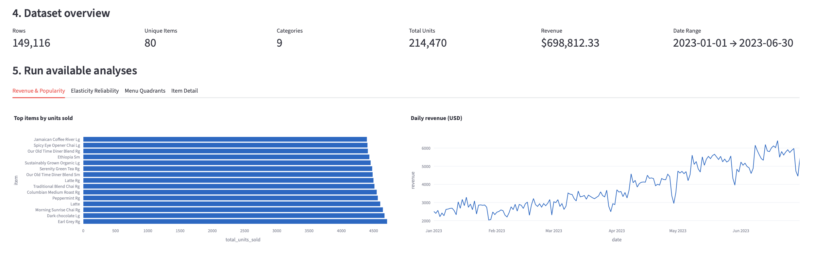
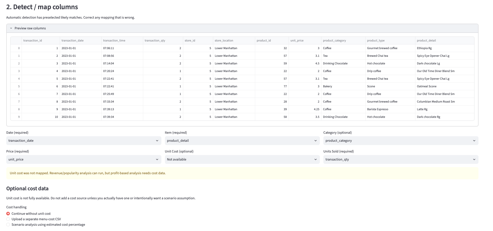
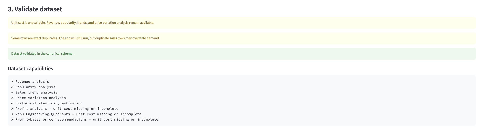
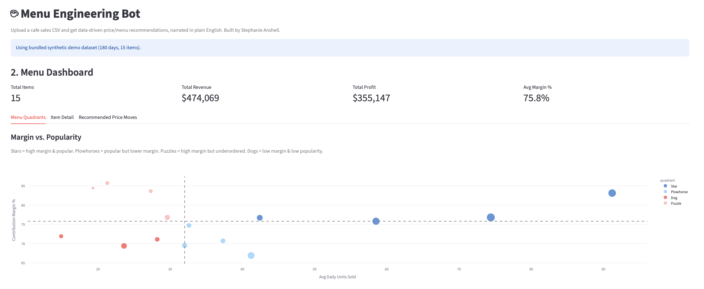
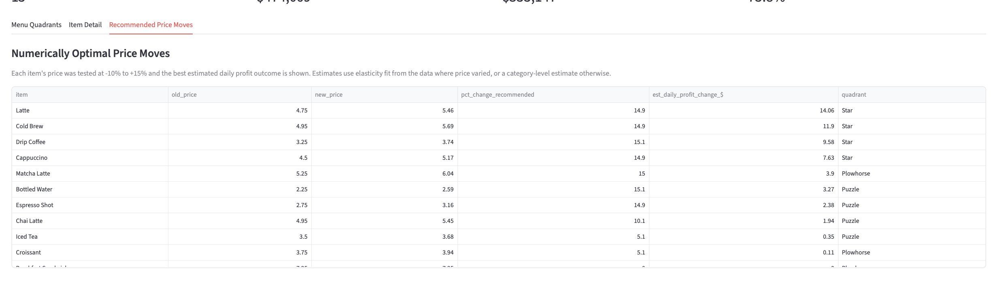
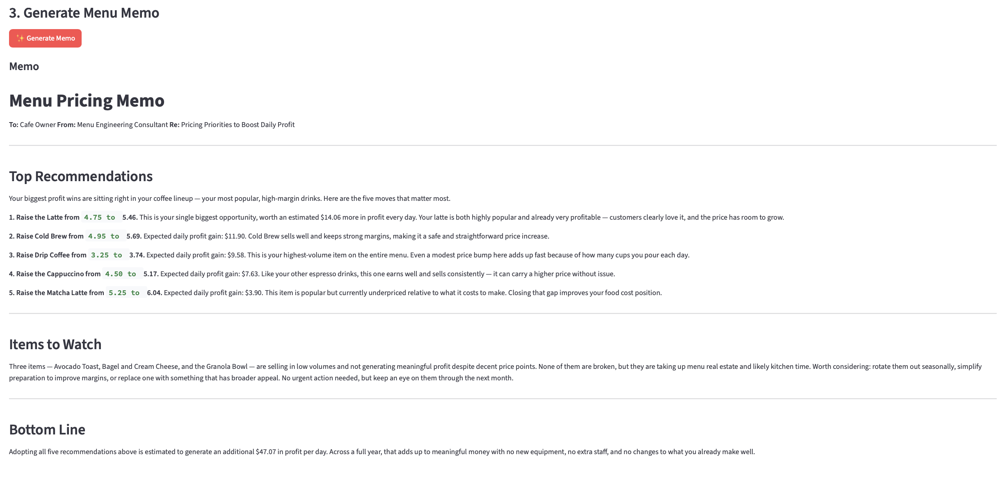

# Menu Engineering Bot

> A universal menu and POS analytics application that adapts unfamiliar transaction data into a canonical schema, runs deterministic menu-engineering and pricing analysis, and uses an LLM only to explain computed results.

Menu Engineering Bot combines **data engineering, business analytics, pricing analysis, and AI-assisted decision support** in one Streamlit application.

The project is intentionally demonstrated with **two different data situations**:

| Demo | Purpose | Cost data? | What it demonstrates |
|---|---|---:|---|
| **External Maven Roasters transaction dataset** | Real-world-style ingestion test | No | Schema adaptation, missing-field handling, revenue/popularity analysis, capability detection |
| **Bundled Synthetic Cafe demo** | Full end-to-end demo | Yes | Contribution margin, menu quadrants, price recommendations, AI decision memo |

This distinction is important: the app does not invent confidential cost data when an external dataset does not provide it.



---

## Why I Built This

Restaurant, cafe, and POS exports rarely use one standard schema.

One dataset may contain:

```text
transaction_date
product_detail
product_category
unit_price
transaction_qty
```

while another may contain:

```text
Date
Menu Item
Type
Selling Price
COGS
Qty
```

A reusable analytics engine should not need to be rewritten for every new dataset.

Menu Engineering Bot solves this by separating **data adaptation** from **deterministic analysis**:

```text
Raw POS / Menu Data
        ↓
Delimiter Detection
        ↓
Automatic Column Detection + Manual Mapping
        ↓
Canonical Dataset
        ↓
Validation + Capability Detection
        ↓
Deterministic Analytics Engine
        ↓
Pricing / Menu Recommendations
        ↓
LLM Explanation Layer
```

The LLM never performs the financial calculations.

---

## 1. Universal Data Adapter

External datasets do not need to use the project's internal column names.

The application automatically detects common fields, then lets the user correct mappings through Streamlit if needed.



For the external Maven Roasters transaction dataset, the app maps fields such as:

```text
transaction_date   → date
product_detail     → item
product_category   → category
unit_price         → price
transaction_qty    → units_sold
```

The internal analytics engine then receives one stable canonical schema:

```text
date
item
category
price
unit_cost
units_sold
```

`analysis.py` therefore does not care whether the original data came from a cafe CSV, restaurant export, coffee-chain dataset, or POS system.

### Supported delimiter styles

The upload layer can detect common delimited-file formats including:

```text
comma       ,
pipe        |
semicolon   ;
tab         \t
```

This matters because files with a `.csv` extension are not always comma-separated.

---

## 2. Capability-Aware Analysis

Not every external dataset contains all fields required for profit analysis.

The Maven Roasters transaction dataset used for testing includes price, quantity, product, category, and date information, but it does **not** provide actual unit cost.

The app handles this explicitly:



With no unit-cost data, the application can still run:

- revenue analysis
- sales volume and popularity analysis
- item rankings
- product mix analysis
- sales trends
- price variation analysis
- elasticity analysis when sufficient historical variation exists

It disables actual profit-dependent features such as:

- contribution-margin analysis
- actual profit analysis
- Star / Plowhorse / Puzzle / Dog classification
- profit-based price optimization

unless cost information is available.

Users may optionally:

1. upload a separate menu-cost file, or
2. intentionally run a scenario using an estimated cost percentage.

Any scenario cost is clearly labeled as an **assumption**, not a measured business cost.

---

## 3. External Dataset Demo — Maven Roasters

The universal adapter was tested with an external Maven Roasters coffee-shop transaction dataset containing fields such as:

```text
transaction_id
transaction_date
transaction_time
transaction_qty
store_id
store_location
product_id
unit_price
product_category
product_type
product_detail
```

The uploaded dataset contains:

- **149,116 transaction rows**
- **80 unique items**
- **9 product categories**
- **214,470 total units**
- approximately **$698K in recorded revenue**
- transactions spanning **January–June 2023**


This example demonstrates that the application can ingest a non-canonical schema without rewriting the analytics engine.

> The raw external Maven dataset is not bundled in this repository. It is used only as an external compatibility example.

---

## 4. Bundled Synthetic Demo — Full Menu Engineering

The repository includes a synthetic cafe dataset with complete fields, including unit cost.

This allows the entire pipeline to be demonstrated without implying access to confidential company economics.

When cost information exists, the application calculates:

- contribution margin
- total revenue
- total contribution profit
- average daily units sold
- menu popularity
- Star / Plowhorse / Puzzle / Dog classification
- scenario-based price recommendations



### Menu Engineering Quadrants

| Quadrant | Popularity | Margin | Interpretation |
|---|---|---|---|
| **Star** | High | High | Strong performers |
| **Plowhorse** | High | Low | Popular but margin constrained |
| **Puzzle** | Low | High | Profitable but under-selected |
| **Dog** | Low | Low | Candidates for review |

The synthetic demo is the correct place to evaluate the full margin-based menu-engineering workflow because its cost data is known and intentionally generated for the project.

---

## 5. Price Elasticity

When enough historical price variation exists, the application estimates item-level price elasticity using:

```text
log(quantity) ~ log(price)
```

Before treating the result as a historical estimate, the model checks:

- number of observations
- number of unique price points
- amount of price variation
- zero or invalid quantities
- very small samples
- extreme elasticity estimates

Every item exposes reliability metadata:

```text
elasticity
elasticity_source
elasticity_confidence
price_points
observations
```

Possible sources include:

```text
estimated
category_prior
default_prior
insufficient_data
```

Confidence labels include:

```text
High
Medium
Low
Prior
```

A category prior is therefore never presented as though it were directly estimated from historical customer behavior.

Unknown product categories automatically fall back to a configurable generic prior.

---

## 6. Deterministic Price Simulation

Price recommendations are generated in Python, not by the LLM.

Candidate price changes are configurable, with defaults such as:

```python
[-0.10, -0.05, 0.00, 0.05, 0.10, 0.15]
```

When cost data exists, the engine evaluates price scenarios using:

- current price
- unit cost
- average demand
- elasticity
- simulated demand response
- resulting contribution profit



The recommendation output also exposes:

```text
elasticity_source
elasticity_confidence
```

so low-confidence or prior-based assumptions remain visible.

---

## 7. AI Decision Memo

Claude is used only after all numerical analysis is complete.

The LLM receives already-computed values and converts them into a concise management memo.



The AI layer is instructed to:

- explain only computed results
- never invent financial values
- never replace deterministic calculations
- distinguish measured results from assumptions
- mention low-confidence elasticity where relevant
- avoid profit claims if real cost data is unavailable
- provide practical recommendations for restaurant, cafe, or food-service managers

The architecture deliberately preserves this separation:

```text
DATA
 ↓
DETERMINISTIC ANALYSIS
 ↓
BUSINESS RECOMMENDATION NUMBERS
 ↓
LLM EXPLANATION
```

---

## 8. Currency Support

The dashboard currently supports:

```text
USD
IDR
EUR
GBP
```

Currency formatting is centralized so the implementation is easy to extend.

The analysis engine does not hardcode `$`.

---

## Project Architecture

```text
menu-engineering-bot/
├── assets/
│   ├── dashboard.png
│   ├── column_mapping.png
│   ├── capabilities.png
│   ├── quadrant_chart.png
│   ├── price_moves.png
│   └── ai_memo.png
│
├── data/
│   ├── cafe_sales.csv
│   └── menu_reference.csv
│
├── src/
│   ├── app.py
│   ├── data_adapter.py
│   ├── validation.py
│   ├── analysis.py
│   ├── config.py
│   ├── agent.py
│   └── generate_data.py
│
├── tests/
│   └── test_universal_pipeline.py
│
├── .env.example
├── .gitignore
├── requirements.txt
└── README.md
```

### Module Responsibilities

**`data_adapter.py`**  
Reads uploaded data, detects common delimiters, recognizes columns, validates mappings, handles optional cost sources, and converts data into the canonical schema.

**`validation.py`**  
Checks data quality and determines which analytical capabilities are available.

**`analysis.py`**  
Contains deterministic revenue, margin, elasticity, menu classification, and pricing calculations.

**`config.py`**  
Stores column aliases, elasticity priors, fallback settings, currencies, and price simulation configuration.

**`agent.py`**  
Converts already-computed analytical results into a management memo using Claude.

**`app.py`**  
Provides the Streamlit workflow and visualizations.

---

## Installation

Clone the repository:

```bash
git clone https://github.com/stephaniepatriciaans/menu-engineering-bot.git
cd menu-engineering-bot
```

Create a virtual environment:

```bash
python3 -m venv venv
source venv/bin/activate
```

Install dependencies:

```bash
pip install -r requirements.txt
```

Run the application:

```bash
streamlit run src/app.py
```

Then open:

```text
http://localhost:8501
```

---

## Optional Claude Integration

All deterministic analytics work without an API key.

To enable the AI decision memo:

```bash
cp .env.example .env
```

Add your own Anthropic key to `.env`:

```text
ANTHROPIC_API_KEY=your_key_here
```

Then restart Streamlit.

> `.env` is excluded from Git and should never be committed.

---

## Running Tests

Run:

```bash
python -m unittest discover -s tests -v
```

The lightweight test suite covers:

- canonical input format
- alternate external column names
- missing unit cost
- unknown product categories
- estimated-cost scenarios

The project is designed so dataset-specific differences are handled by the adapter rather than the analytics engine.

---

## Data & Modeling Limitations

Public restaurant and coffee-shop datasets often contain transaction dates, product names, quantities, categories, and selling prices, but may not contain confidential information such as:

```text
actual unit costs
store contribution margins
supplier contracts
internal demand curves
operating economics
```

Menu Engineering Bot does not fabricate these values.

If the user intentionally enables an estimated-cost scenario, the application labels the resulting profit and pricing outputs as scenario results rather than actual business performance.

Similarly, elasticity priors are modeling assumptions and are distinguished from historical estimates through:

```text
elasticity_source
elasticity_confidence
```

---

## Tech Stack

**Python · pandas · NumPy · Streamlit · Plotly · Anthropic Claude API · unittest**

---

## What This Project Demonstrates

### Data Engineering
Adapting heterogeneous POS and menu datasets into one stable canonical schema.

### Business Analytics
Revenue, volume, contribution margin, product mix, and menu-engineering classification.

### Pricing Analytics
Elasticity reliability checks and deterministic scenario-based price simulation.

### Applied AI
Using an LLM to explain analytical outputs without delegating numerical reasoning to the model.

---

## Demo Strategy

This repository intentionally uses two examples:

### External transaction dataset
Used to demonstrate that the application can adapt an unfamiliar schema and degrade gracefully when cost data is missing.

### Bundled synthetic dataset
Used to demonstrate the full profit-based menu-engineering workflow with complete known inputs.

Together, these two examples show both **real-world robustness** and **full analytical capability**.

---

Built by [Stephanie Anshell](https://github.com/stephaniepatriciaans)  
[Portfolio](https://stephaniepatriciaans.github.io/portfolio)
